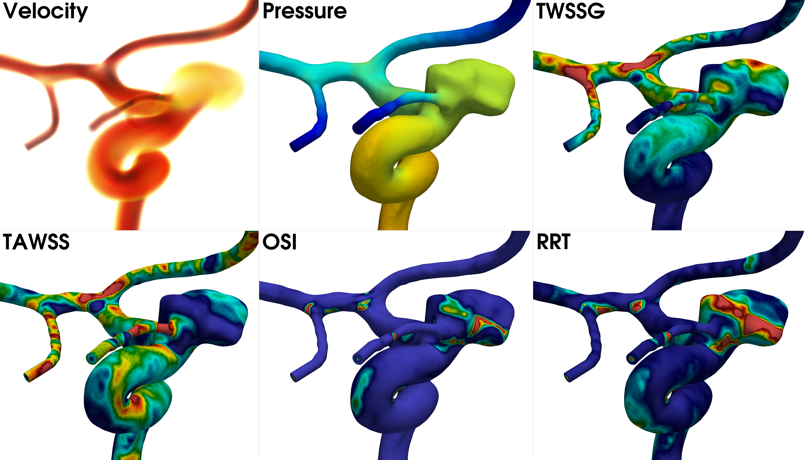
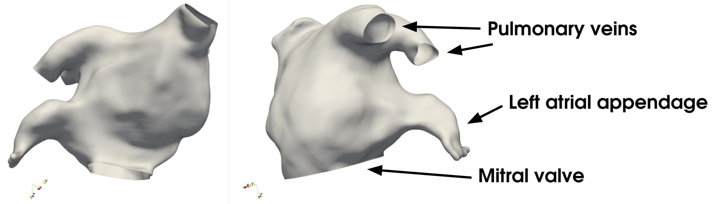
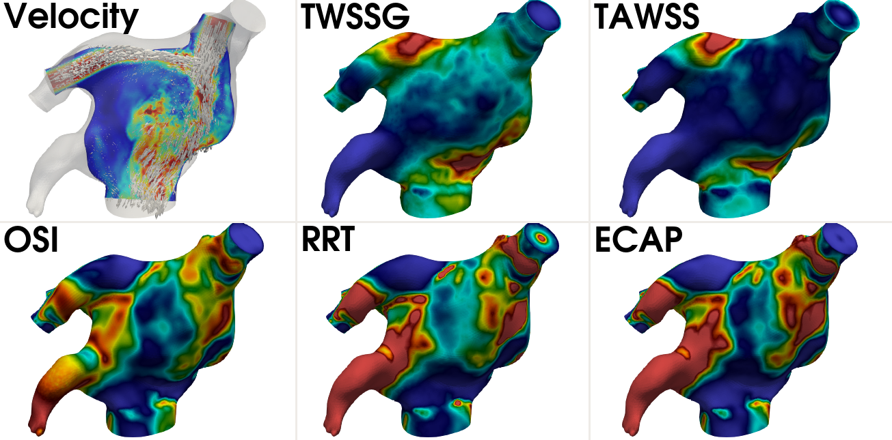

.. title::  Tutorials

.. _tutorials:

=========
Tutorials
=========
.. highlight:: console

This tutorial is meant to guide through the basic steps of performing a computational fluid dynamic (CFD) simulation in a vascular body.
The tutorial is divided into two main sections where we will first consider a model of the `internal carotid artery <https://en.wikipedia.org/wiki/Internal_carotid_artery>`_ (ICA) with an aneurysm, followed by a model of the left atrium.
For the ICA, we will demonstrate different approaches for meshing and pre-processing of the model, followed by a CFD simulation using the Oasis software, before post-processing the results.
For the left atrium model, we will investigate local refinement in a user-defined region, also followed by CFD simulation and post-processing of the results.

We assume that you have VaMPy installed, meaning you have a working version of *morphMan* and *Oasis* on your computer. It is also beneficial, but not necessary, that you are familiar with the `ParaView <https://www.paraview.org/>`_ visualization software, which we will frequently be using to visualize the geometries and results.

Tutorial 1: High-resolution CFD simulation in the internal carotid artery
=========================================================================

For this tutorial we consider an internal carotid artery model from the public dataset `Aneurisk <http://ecm2.mathcs.emory.edu/aneuriskweb/index>`_, and have used the first model; case `C0001 <https://github.com/hkjeldsberg/AneuriskDatabase/tree/master/models/C0001>`_.

Meshing with a constant edge length
-----------------------------------
We start the tutorial by performing pre-processing using a constant edge length, resulting in a constant density mesh.
This is performed by supplying the ``-m constant`` flag, and the ``-el N`` flag, where the latter determines the uniform edge length in N millimeters (mm), controlling the coarseness or fineness of the mesh.
To generate a volumetric mesh with a edge length of 0.3 mm, run the following command after downloading the C0001 case::

        $ python automatedPreProcessing/automatedPreProcessing.py -m constant -el 0.3 -i C0001/model.vtp -bl False

Note that we have also applied the ``-bl False``, meaning we do not add boundary layers to the model. For this particular model, adding boundary layers would have required a smaller edge length because of the tiny arteries that the model harbours.
The resulting volumetric mesh is shown in Figure 1, with a zoomed in view on the aneurysm.

.. figure:: constant_vol.png

  Figure 1: A constant density mesh, with a zoomed in view of the aneurysm. Note that all tetrahedral cells are of equal size.

Meshing based on the surface curvature
--------------------------------------
A more rigorous approach is to mesh the vascular model based on its surface curvature, which can be beneficial to use for models which harbour many regions of high curvature.
An example of such models are complex geometries such as aneurysms or carotid siphons, where it is recommended to have a denser mesh in the vicinity of the complex morphology.
Meshing based on the surface curvature is performed by  supplying the ``-m curvature`` flag, and optionally the ``--coarseningFactor`` flag, or ``-c`` for short.
The ``--coarseningFactor`` flag determines the  coarseness or fineness of the mesh, where values > 1.0 will coarsen the mesh, and vice versa, with a default value of 1.0.
To generate a variable density mesh based on the surface curvature, run the following command::

    $ python automatedPreProcessing/automatedPreProcessing.py -m curvature -c 1.2 -i C0001/model.vtp

The resulting volumetric mesh is shown in Figure 2, with a zoomed in view on the aneurysm.

.. figure:: curvature_vol.png

  Figure 2: A variable density mesh based on the surface curvature, with a zoomed in view of the aneurysm. Note that the mesh is refined along the tiny, high-curvature artery, and coarser along the larger parent artery.

Meshing based on the centerline diameter
----------------------------------------
As an alternative to the curvature method, as explained above, meshing based on the centerline diameter can be practical in tubular structures such as arteries.
To get an intuition for what is meant by `centerline diameter`, we are in fact describing the diameter of a maximally inscribed sphere along the centerline located inside the object.
This means that for tiny arteries, the diameter will be small, and vice versa for larger arteries, as shown in Figure 3.
Consequently, the mesh will be finer within tiny arteries, and coarser in larger arteries.

.. figure:: misr.png

  Figure 3: The centerline inside the surface model, colored by it's maximum inscribed sphere diameter.

Meshing based on the centerline diameter is performed by supplying the ``-m diameter`` flag, and optionally the ``--coarseningFactor`` flag, as above.
To generate a variable density mesh based on the centerline diameter, run the following command::

    $ python automatedPreProcessing/automatedPreProcessing.py -m diameter -c 1.2 -i C0001/model.vtp

The resulting volumetric mesh is shown in Figure 4, with a zoomed in view on the aneurysm.

.. figure:: diameter_vol.png

  Figure 4: A variable density mesh based on the centerline diameter , with a zoomed in view of the aneurysm. Note the difference in refinement between tiny and large arteries.

It should be noted that because the aneurysm in itself does not harbour any centerline, it becomes coarse.
However, this is something we will investigate in Tutorial 2, where we will refine a pre-defined regions of the geometry.

High-resolution simulation of the ICA
-------------------------------------
In the concluding part of this tutorial we will generate a high-resolution volumetric mesh of the ICA, perform CFD simulation, and present the hemodynamic forces based on the results.
For simplicity, we chose to mesh the artery model using a constant density mesh using the following command::

    $ python automatedPreProcessing/automatedPreProcessing.py -m constant -el 0.1 -i C0001/model.vtp

Running the command results in a volumetric mesh consisting of ~20M tetrahedral cells, as shown in Figure 5.

.. figure:: mesh_20M.png

  Figure 5: A constant density mesh consisting of approximately 20M tetrahedral cells, with a zoomed in view of the aneurysm.

The mesh is used as input to the CFD simulations, followed by computation of the hemodynamic indices, which are initiated as described in :ref:`getting_started`.
The simulation was run for one cardiac cycle, corresponding to 0.951 s, with :math:`\Delta t =` 0.0951 ms resulting in a total of 10 000 time steps per cycle.
In Figure 6 we present the volumetric rendering of velocity during peak systole, the Q-criterion, and four hemodynamic indices; temporal wall shear stress gradient (TWSSG), time averaged wall shear stress (TAWSS), oscillatory shear index (OSI), and relative residence time (RRT).

  Figure 6: From left to right: the volumetric rendering of velocity, the Q-criterion, TWSSG, TAWSS, OSI, and RRT.

Tutorial 2: Hemodynamics simulation on a left atrium
====================================================
The second tutorial focuses on a left atrium geometry, collected from a published public dataset by Roney et al. [1]_, located `here <https://zenodo.org/record/3764917#.YyHwsuxByDV>`_.
In particular, we selected the endocardium model labeled ``LA_Endo_5.vtk`` in the dataset, representing the inner left atrium wall.
The tutorial is meant to demonstrate that VaMPy is also applicable to other vascular domains, not only tubular structures.

.. note::
    Because VaMPy relies on ``vtkPolyData`` as input, the ``.vtk`` model needs to be converted to ``.vtp`` format, which can quicly be done in ParaView by using the ``Extract Surface`` filter, and saving the data as ``LA_Endo_5.vtp``.

Meshing an atrium with refined appendage
-----------------------------------------
The morphology of the left atrium is shown in Figure 6, and typically includes an average of four `pulmonary veins` leading to a large chamber where blood circulates during the atrial diastole, before being pumped through the `mitral valve` into the left ventricle during atrial systole.
In addition, on the left side of the chamber, the left atrium harbours the `left atrial appendage`, a small pouch-like extension of the atrium and known to the most prone site of blood clot formation.
Hence, this region of the left atrium is of interest, similar to aneurysms as presented earlier.

  Figure 6: The surface model considered in this tutorial, where we have marked two of the four pulmonary veins, the left atrial appendage, and the mitral valve.

Therefore, to ensure that the hemodynamics are captured sufficiently inside the left atrial appendage, we will perform mesh generation with refinement of this particular region.
To manually refine a region on the geometry, the user may provide the ``--refine-region True`` flag, or ``-r True`` for short.
Thus, to include a user-defined area of refinement, run the following command::

    $ python automatedPreProcessing/automatedPreProcessing.py -m constant -i LA_Endo/5/LA_Endo_5.vtp -r True -el 1.5 -bl False -fli 1 -flo 3 -at True

Here, the ``-fli`` and ``-flo`` flags determine the length of the flow extensions at the inlets and outlet, respectively, and the ``-at`` flag is used to notify the pipeline that an atrium model is being meshed.
By executing the command above, the mesh generation becomes `semi-automated`, and a render window will eventually pop up, asking the user to specify a point on the surface that will represent the region that will be refined, as shown in Figure 7.
Navigate with the mouse, and press ``space`` to place a point, ``u`` to undo, and ``q`` to proceed.
The rest of the meshing pipeline is automated.
Alternatively, the user may supply the ``--region-points`` (``-rp`` for short), followed by three numbers representing the :math:`x, y`, and :math:`z` coordinates of the point, make the the pipeline fully `automated` again.
If the point is located slightly off the surface, it will stick to the closest surface point.
For the point shown in Figure 7, this would correspond to running the following command::

    $ python automatedPreProcessing/automatedPreProcessing.py -m constant -i LA_Endo/5/LA_Endo_5.vtp -r True -rp 29.8 28.7 66.5 -el 1.5 -bl False -fli 1 -flo 3 -at True

.. figure:: la_vmtk.png

  Figure 7: VMTK render window for placing a seed, corresponding to area that will be refined.

Using the command above should result in a volumetric mesh consisting of ~3.1M tetrahedral cells, as shown in Figure 8, also displaying the refinement in the left atrial appendage, including four boundary layers.

.. figure:: la_mesh.png

  Figure 8: Volumetric mesh of the left atrium model, with a zoomed in view of the left atrial appendage, clipped to display the refinement and four boundary layers.

CFD simulation of the left atrium
---------------------------------
The resulting mesh from the previous section is now used as input to the CFD simulations, followed by computation of the hemodynamic indices.
The only real difference from the artery problem from eariler is that instead of running the ``Artery.py`` problem file, we here will be solving the problem defined in ``Atrium.py``, also located in the ``simulation`` folder.
Assuming the user has navigated to the ``simulation`` folder, running a left atrial CFD simulation can performed by executing the following command::

       $ oasis NSfracStep problem=Atrium mesh_path=../LA_Endo/5/LA_5_Endo.xml.gz T=951 save_solution_after_cycle=0

Running the simulations will create the result folder ``results_atrium``, with the results and corresponding mesh saved compactly in HDF5 format.
For this particular model, the simulation was run for one cardiac cycle, corresponding to 0.951 s, with :math:`\Delta t =` 0.951 ms resulting in a total of 1000 time steps per cycle.
Finally, in Figure 9 we present a velocity slice with vectors, the temporal wall shear stress gradient (TWSSG), time averaged wall shear stress (TAWSS), oscillatory shear index (OSI), relative residence time (RRT), and the endothelial cell activation potential (ECAP).

   Figure 9: From left to right: a slice through the geometry displaying the velocity field and corresponding vectors scaled by the velocity magnitude, TWSSG, TAWSS, OSI, RRT, and ECAP.

.. [1] Roney, Caroline. (2020). Constructing a Human Atrial Fibre Atlas, Roney et al. [Data set]. Zenodo. https://doi.org/10.5281/zenodo.3764917